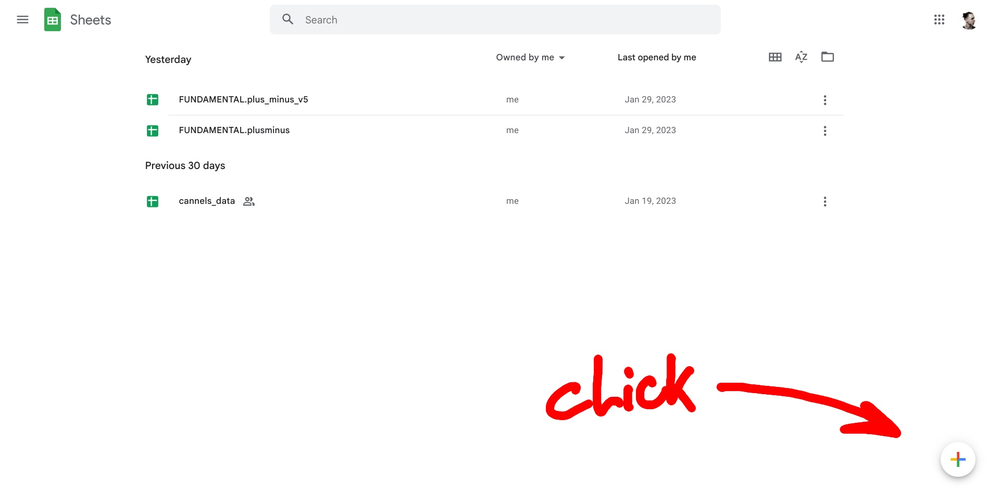
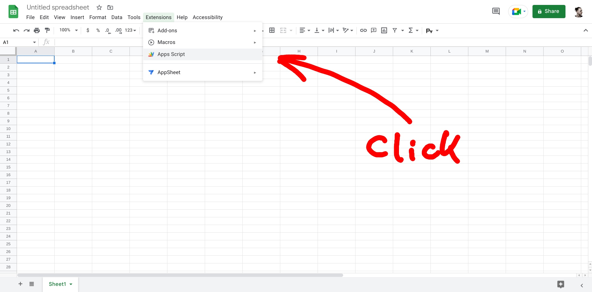
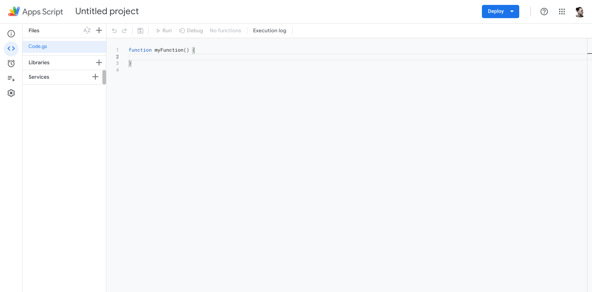
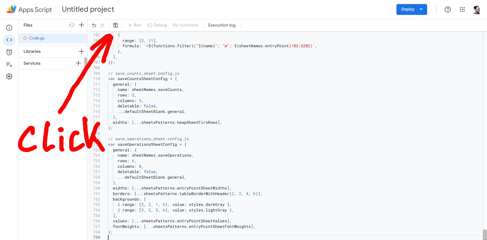
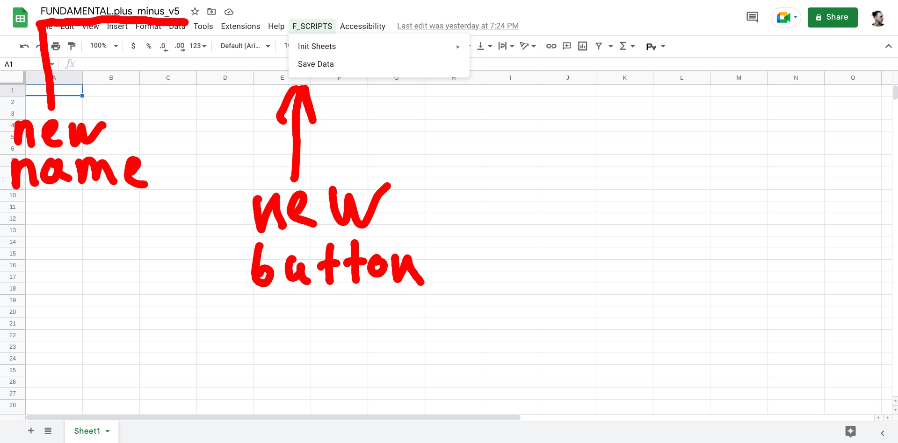
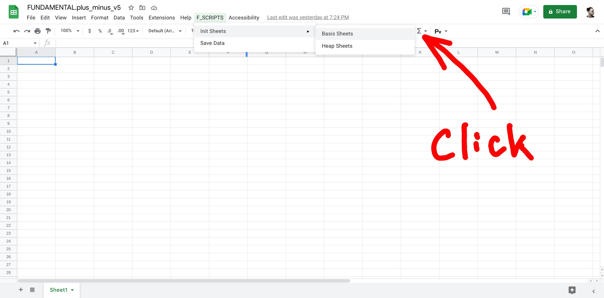

# FUNDAMENTAL.plus_minus_v5

## Application that help you count your finance that basis on Google Sheets!

### How to deploy it?
- You need to instal [Node.js](https://nodejs.org/en/) on your computer
- Clone this repo on your computer
- In repo root folder run **npm bundle**
- After that in root folder you can see application.js just open it and copy(ctrl+a, ctrl+c)
- go to service Google Sheets and create default sheet
  
- click on **Extensions**, click on **Apps Script**
  
- clear editor and paste recently copy code to editor(ctrl+a, backspace, ctrl+v)
  
- save file and close the browser tab with editor
  
- go back to your default sheet and reload page
- wait some time, and you can see that sheet name was change and you have one new button in user interface
  
- click on **F_SCRIPTS**, click on **Init Sheets**, click on **Basis Sheets**
  
- your need to allow access on Google oauth screen
- click on **F_SCRIPTS**, click on **Init Sheets**, click on **Basis Sheets**

### My congratulations you have initiated basic spreadsheets!
